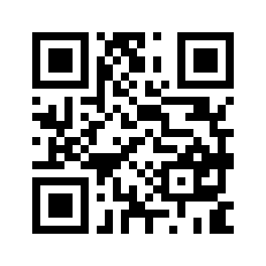

# Mobile App for Grassroots Field Trials

## Description

The mobile app displays and submit the observations in field trials. It is written in Flutter and will available for both Android and iOS. The current version is a prototype and it is only available for Android.

The app scans QR codes which identify individual plots within a field trial study. It then displays the details of the plot on the screen. The user have the option to enter new  observations for the plot and submit them to the Grassroots Field Trial system.

The app is can be downloaded from the [Google Play Store](https://play.google.com/store/apps/details?id=tools.grassroots.qr_reader).
 

## Usage

The unique id for each plot in a study is encoded as a QR code. The app scans the QR code and retrieves the details of a given plot. At the moment there will be only one simple study with QR codes available for testing. 

This a sample QR code for the plot 1 in the test study:

